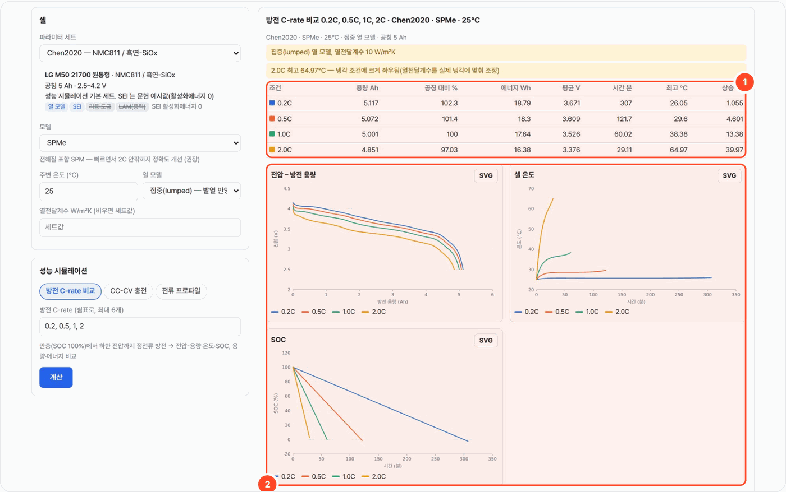
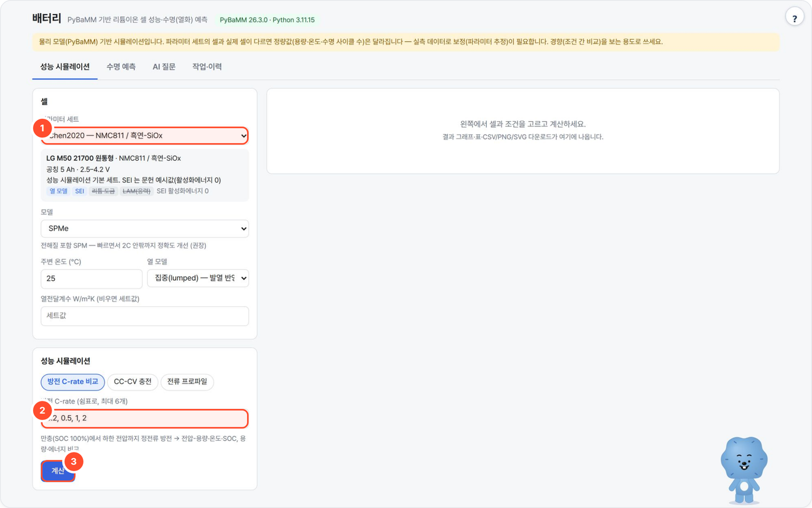

# battery-local — PyBaMM 배터리 성능·수명(열화) 예측

PyBaMM 물리 모델로 리튬이온 셀의 방전·충전 성능과 사이클 수명(SOH·EOL·LLI/LAM)을 계산하는 로컬 웹 도구입니다. 포트 `8785`.



## 무엇을 하나

- PyBaMM 내장 파라미터 세트(LG M50·Kokam·A123 LFP 등)와 SPM / SPMe / DFN 모델로 **정전류 방전 C-rate 비교, CC-CV 충전, 사용자 전류 프로파일**을 계산합니다. 집중(lumped) 열 모델을 켜면 발열에 따른 셀 온도도 나옵니다.
- SEI 성장·리튬 도금·활물질 손실(입자 균열) 서브모델을 켠 사이클 실험으로 **용량 유지율(SOH) 곡선·EOL 사이클·LLI/LAM 기여**를 예측하고, 충전 C-rate·온도·DoD 를 바꾼 2~4개 시나리오를 한 그래프에 비교합니다.
- 로컬 LLM(포털 기본: Ollama `gemma4:31b`)은 자연어 질문 → 실험 설정(JSON) 변환과 **계산 수치만 근거로 한 해설**에만 씁니다. 숫자는 전부 PyBaMM 이 계산합니다.
- 웹 서버는 표준 라이브러리만, 계산은 서버의 PyBaMM conda 환경을 서브프로세스로 호출(복사·수정 없음). CDN 없음, 외부 전송 없음.

## 사용 방법



1. **성능 시뮬레이션** 탭의 **셀** 카드에서 파라미터 세트(①, 예: Chen2020 — NMC811 / 흑연-SiOx), 모델(SPM / SPMe 권장 / DFN), 주변 온도, 열 모델(등온 또는 집중)을 고릅니다.
2. **방전 C-rate 비교**에서 C-rate 를 쉼표로 적고(②, 예: `0.2, 0.5, 1, 2`, 최대 6개) **계산**(③)을 누릅니다. CC-CV 충전·전류 프로파일도 같은 자리에서 고릅니다.
3. 결과의 요약 표(결과 화면 ①: 용량·공칭 대비·에너지·평균 전압·시간·최고 온도·상승)와 전압-방전 용량·셀 온도·SOC 차트(②)를 봅니다. 차트마다 **SVG** 저장, 아래에서 CSV·PNG·result.json 을 받습니다.
4. 수명은 **수명 예측** 탭(SOH 기준 80% EOL, LLI/LAM·SEI·도금), 자연어 질문은 **AI 질문** 탭, 지난 계산은 **작업·이력** 탭에서 엽니다. 긴 계산은 창을 닫아도 서버에서 계속 돕니다.

## 예시

포털 경유로 실제 실행한 결과입니다(2026-10-07, 작업 `20261007-064229-d694`, 약 4초).

- **입력**: Chen2020 (LG M50 21700, 공칭 5 Ah) · SPMe · 집중(lumped) 열 모델 · 25°C · 방전 C-rate `0.2, 0.5, 1, 2`
- **출력**:

| C-rate | 용량 Ah | 에너지 Wh | 시간 분 | 최고 °C |
|---|---|---|---|---|
| 0.2C | 5.117 | 18.79 | 307 | 26.05 |
| 0.5C | 5.072 | 18.3 | 121.7 | 29.6 |
| 1.0C | 5.001 | 17.64 | 60.02 | 38.38 |
| 2.0C | 4.851 | 16.38 | 29.11 | 64.97 |

화면은 "2.0C 최고 64.97°C — 냉각 조건에 크게 좌우됨(열전달계수를 실제 냉각에 맞춰 조정)" 경고를 함께 보여 줍니다(열전달계수 10 W/m²K).

## 설치·실행

```bash
bash setup.sh                 # Python → PyBaMM 환경 탐색 → LLM 탐색 → selftest → http://localhost:8785
bash setup.sh stop
python3 app.py                # 수동 실행 (BATTERY_PY 를 주면 그 python 으로 계산)
python3 app.py --cli job.json # 작업 하나를 큐로 돌리고 결과 요약(JSON) 출력
python3 selftest.py           # 실제 PyBaMM 짧은 계산 + 가짜 LLM 검증 (임시 WORKSPACE, 약 30초)
```

| 환경변수 | 기본 | 설명 |
|---|---|---|
| `PORT` / `HOST` | `8785` / `0.0.0.0` | |
| `BATTERY_PY` | 자동 탐색 | PyBaMM 이 import 되는 python (`~/miniforge3/envs/pybamm-inv/bin/python` 등) |
| `BATTERY_JOBS` | `2` | 동시에 도는 계산 수 (나머지는 대기열) |
| `BATTERY_THREADS` | `2` | 계산 하나의 OpenMP/BLAS 스레드. 워커는 `nice +10` 으로 돈다 |
| `BATTERY_TIMEOUT` | `7200` | 작업 하나 최대 초 |
| `BATTERY_MAX_CYCLES` | `5000` | 수명 계산 최대 사이클 |
| `WORKSPACE` | `./_workspace` | `jobs/<id>/` (job.json·status.json·result.json·partial.json·CSV·PNG·explain.json), `cache/meta.json` |
| `LLM_API` / `LLM_BASE_URL` / `LLM_MODEL` | `ollama` / `http://localhost:11434` / `qwen3:8b` | AI 질문·해설용(없어도 계산은 됨). 포털로 띄우면 로컬 Ollama(`:11436`)의 `gemma4:31b` 가 넘어옴 |

## 구조
- `app.py` — HTTP 서버·작업 큐(백그라운드, 진행률, 취소, 재시작 시 중단 표시)·설정 검증·LLM(질문→JSON, 해설, 숫자 검사)
- `worker.py` — PyBaMM python 으로 `python -I worker.py meta|run` 실행. `-I`(격리 모드)라 현재 폴더의 같은 이름 파일이 표준 모듈을 가리지 않습니다.
  - `meta`: 설치된 PyBaMM 의 세트별로 `process_model` 을 실제로 걸어 열 모델·SEI(모델별)·도금·응력 LAM 지원 여부를 판정(파라미터가 없거나 0이면 숨김) → `cache/meta.json`
  - `rate`·`charge`·`drive`: IDAKLU 솔버, 집중(lumped) 열 모델(세트가 지원하면), 결과 400점으로 줄여 JSON·CSV·PNG
  - `life`: 10사이클씩 끊어 `starting_solution=last_state` 로 이어 풀기(메모리 일정) → 사이클마다 PyBaMM summary variables
    (`Capacity [A.h]`, `Loss of lithium inventory [%]`, `Loss of active material in negative/positive electrode [%]`,
    `Loss of capacity to negative SEI / lithium plating / SEI on cracks [A.h]`) + 사이클 방전 용량.
    단계 50 → 200 → 500 → 1000 → … → 최대 사이클, 단계마다 `partial.json`(화면에 '단계 결과'), SOH 가 기준 아래면 멈춤.
- `ui.html` — 자체 SVG 차트(호버 툴팁·SVG 저장), 라이트/다크.

## 수명 예측의 정의
- **SOH** = 사이클마다 PyBaMM eSOH `Capacity [A.h]`(전압 한계 사이 평형 용량 = 저율 RPT 용량에 해당) / 1회차 값. DoD < 100% 여도 같은 기준.
  전체 방전 사이클이면 사이클링 전류에서의 **방전 용량 유지율**도 함께 보여 줍니다(저항 증가 영향 포함).
- **EOL** = SOH 가 기준(기본 80%)을 처음 지나는 사이클(선형 보간). 계산 범위 안에서 도달 못 하면 손실 L(n) = a·√n + b·n (a,b ≥ 0) 최소제곱 → **외삽**으로 표시하고 "계산 범위의 몇 배"를 같이 적습니다.
- **열화 모드**: LLI(리튬 재고 손실 %), LAM 음극/양극(%), 부반응별 리튬 손실(SEI·도금·균열면 SEI, Ah).
- 메커니즘 옵션: SEI(`solvent-diffusion limited` 기본, 세트가 지원하는 SEI 모델 선택 가능, `SEI porosity change`), 리튬 도금(`partially reversible` + porosity change),
  활물질 손실(`particle mechanics: swelling and cracking / swelling only`, `loss of active material: stress-driven`, SEI 와 함께면 `SEI on cracks`). 등온(챔버 온도 고정) 가정.
- **SEI 온도 의존**: 세트의 SEI 활성화에너지가 0이면(Chen2020·Mohtat2020 등) 기본으로 38 kJ/mol(OKane2022 값)을 넣어 온도 비교가 의미 있게 합니다(끌 수 있음, 결과 메모에 표시).
- **SEI 속도 배율**: 실측 열화 속도에 맞추기 위한 단순 보정 손잡이(확산계수·반응 속도상수를 배율만큼). 실측 기반 파라미터 추정은 PyBOP 등 별도 도구로.

## 확인된 계산 시간 (이 서버, 스레드 2, nice)
| 계산 | 시간 |
|---|---|
| Chen2020 SPMe 방전 4개 C-rate (집중 열 모델) | 약 5 초 |
| OKane2022 SPM SEI+도금+LAM 1000 사이클 (시나리오 1개) | 약 70 초 |
| 같은 조건 SPMe 100 사이클 / DFN 100 사이클 | 약 40 초 / 약 140 초 |

## 한계
- 물리 모델 시뮬레이션입니다. **파라미터 세트의 셀과 실제 셀이 다르면 정량값은 달라집니다 — 보정(파라미터 추정)이 필요**합니다. 화면·CSV·해설에 항상 표시됩니다.
- PyBaMM 기본 열화 파라미터는 문헌 예시값이라, OKane2022 기본값으로는 1000 사이클 동안 SOH 감소가 몇 % 수준 → EOL 은 대개 외삽(수천~수만 사이클)입니다. 절대 수명보다 **조건 간 상대 비교**로 보세요.
- SPM 은 전극 두께 방향 분포를 무시해 고율·저온의 도금을 덜 잡을 수 있습니다. 결론을 낼 조건은 SPMe/DFN 으로 확인하세요.
- 수명 계산은 등온, 캘린더(보관) 열화·RPT 사이 휴지 시간은 따로 넣지 않으면 반영되지 않습니다(실험 단계 직접 입력으로 `Rest for 10 hours` 등 추가 가능).
- 사용자 프로파일은 전압 한계에 닿으면 그 시점에서 멈춥니다. PyBaMM 의 표준 주행 사이클 파일(US06 등)은 폐쇄망이라 동봉하지 않고, 화면의 '예시 프로파일'은 합성 펄스입니다.

## 출처·감사 (Credits)

- [PyBaMM](https://github.com/pybamm-team/PyBaMM) (BSD-3-Clause) — 전지 모델 계산. 인용: Sulzer et al., *J. Open Res. Softw.* 9(1):14 (2021). 내장 파라미터 세트(Chen2020, OKane2022 등)는 각 원 논문 값이므로 결과 발표 시 해당 논문과 PyBaMM 을 인용하세요.
- pybammsolvers (IDAKLU, SUNDIALS 기반, BSD-3-Clause), [CasADi](https://github.com/casadi/casadi) (LGPL-3.0), NumPy·SciPy (BSD-3-Clause), Matplotlib (선택)
- 모두 서버의 별도 conda 환경에서 서브프로세스로 호출하며 동봉하지 않습니다.
- **LLM 실행** — OpenAI 호환 API 로 호출합니다(모델 가중치는 동봉하지 않음). 기본 배포는 [Ollama](https://github.com/ollama/ollama) (MIT) 위의 Google [Gemma](https://ai.google.dev/gemma) `gemma4:31b` — 모델 이용 조건은 Gemma 배포처 참고.
- 이 도구는 [agent-page-portal](https://github.com/gggg8657/agent-page-portal) 에 연결해 쓰도록 만들었습니다(단독 실행도 됨).

저작권 표기·전체 목록은 `NOTICE` 를 보세요.

## 라이선스

MIT License — Copyright (c) 2026 DongJu Kim (gggg8657). `LICENSE` 를 보세요.
